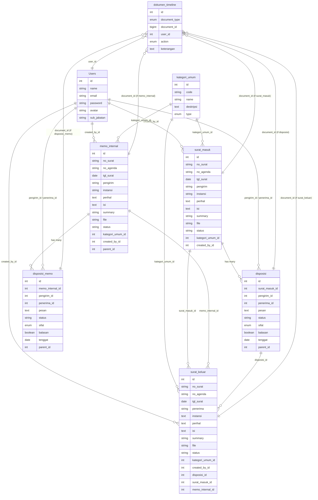

```mermaid
erDiagram
    Users {
        int id
        string name
        string email
        string password
        string avatar
        string sub_jabatan
    }

    kategori_umum {
        int id
        string code
        string name
        text deskripsi
        enum type
    }

    surat_masuk {
        int id
        string no_surat
        string no_agenda
        date tgl_surat
        string pengirim
        string instansi
        text perihal
        text isi
        string summary
        string file
        string status
        int kategori_umum_id
        int created_by_id
    }

    surat_keluar {
        int id
        string no_surat
        string no_agenda
        date tgl_surat
        string penerima
        text instansi
        text perihal
        text isi
        string summary
        string file
        string status
        int kategori_umum_id
        int created_by_id
        int disposisi_id
        int surat_masuk_id
        int memo_internal_id
    }

    memo_internal {
        int id
        string no_surat
        string no_agenda
        date tgl_surat
        string pengirim
        string instansi
        text perihal
        text isi
        string summary
        string file
        string status
        int kategori_umum_id
        int created_by_id
        int parent_id
    }

    disposisi {
        int id
        int surat_masuk_id
        int pengirim_id
        int penerima_id
        text pesan
        string status
        enum sifat
        boolean balasan
        date tenggat
        int parent_id
    }

    disposisi_memo {
        int id
        int memo_internal_id
        int pengirim_id
        int penerima_id
        text pesan
        string status
        enum sifat
        boolean balasan
        date tenggat
        int parent_id
    }

    dokumen_timeline {
        int id
        enum document_type
        bigint document_id
        int user_id
        enum action
        text keterangan
    }

    %% Relations
    surat_masuk ||--o{ disposisi : "has many"
    memo_internal ||--o{ disposisi_memo : "has many"
    Users ||--o{ disposisi : "pengirim_id / penerima_id"
    Users ||--o{ disposisi_memo : "pengirim_id / penerima_id"
    Users ||--o{ surat_masuk : "created_by_id"
    Users ||--o{ surat_keluar : "created_by_id"
    Users ||--o{ memo_internal : "created_by_id"

    kategori_umum ||--o{ surat_masuk : "kategori_umum_id"
    kategori_umum ||--o{ surat_keluar : "kategori_umum_id"
    kategori_umum ||--o{ memo_internal : "kategori_umum_id"

    surat_masuk ||--o{ surat_keluar : "surat_masuk_id"
    memo_internal ||--o{ surat_keluar : "memo_internal_id"

    disposisi ||--o{ surat_keluar : "disposisi_id"

    %% document_timeline polymorphic
    dokumen_timeline }o--|| Users : "user_id"
    dokumen_timeline }o--|| surat_masuk : "document_id (if surat_masuk)"
    dokumen_timeline }o--|| surat_keluar : "document_id (if surat_keluar)"
    dokumen_timeline }o--|| memo_internal : "document_id (if memo_internal)"
    dokumen_timeline }o--|| disposisi : "document_id (if disposisi)"
    dokumen_timeline }o--|| disposisi_memo : "document_id (if disposisi_memo)"
```
# Alur Aplikasi
